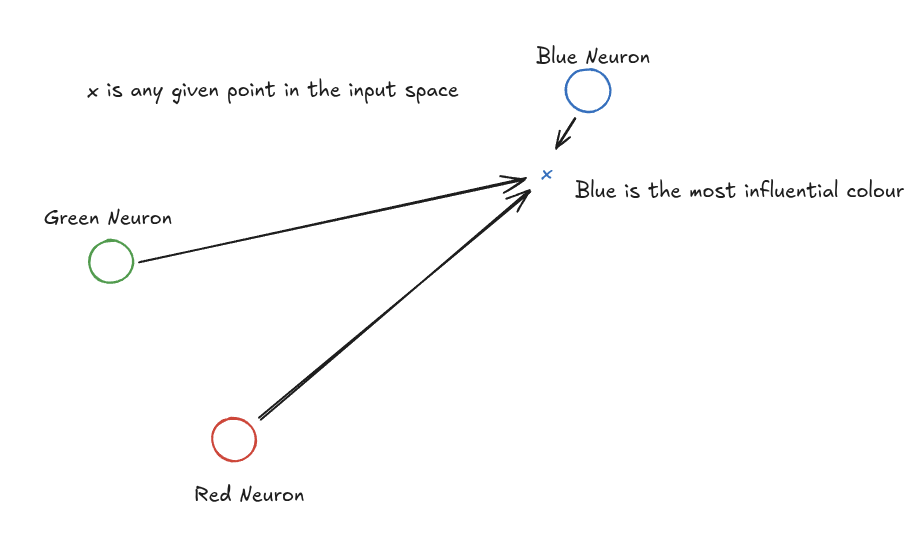
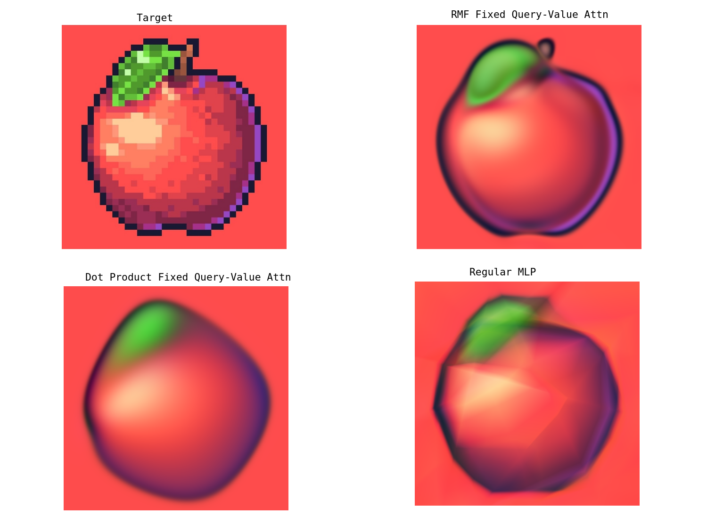

# Spatial Net: Continuous Vector Attention with Radial Metric Fields

A small research playground for modelling 2D neural fields with attention-style interactions between neurons that live in continuous space. The project compares three approaches that all share the same parameter budget and training recipe:

- A radial metric field (RMF) version of my spatial attention block with learnable per-neuron bandwidths.
- A dot-product attention variant that anchors queries/values to static neuron locations.
- A vanilla MLP baseline.

## Neural Field
I have used a neural field (sometimes called compositional pattern producing network) type objective. Here the models are trained recieving x,y coordinates and must output 3 channel values. This is very powerful, because unlike other objectives it means we can very easily observe the entire input-output space of the model in one go (the image reconstruction).

## How I like to frame it: 
When I began this project, I was not thinking about attention at all but rather wether it would be possible to attribute neurons to certain parts of the input space. Imagining the 2D, single-layer, case builds intuition. Consider the 2D image we are attempting to reconstruct. The input space consists of x,y coordinates. Thus in our single layer network, our neurons learn to sit somewhere on this x,y grid. Each neuron holds a belief about what the output colour of the pixel should be. Each neuron also projects an influence field. This influence field is gaussian in nature and parameterised (tigher or broader). This means each neuron has an influence on every x,y input but diminishingly as the input increases in distance. For any given input, we can calculate the output as the softmax influence weighted average of the neuron beliefs.


Now to expand to multilayered, its quite simple. Neuron beliefs can take any number of dimensions. Thus the first layer neurons must 'sit' in a 2D input space, but their beliefs can be N dimensional. The following layer of neurons would just occupy this N dimensional space and so on and so forth.

## Key Things I Learned
- Attention on continuous vectors needs anchors: queries and values have to be tied given we don't have tokens as the input is a single continuous vector.
- Replacing dot-product similarity with the RMF distance metric gave noticeably better reconstructions. The learnable `sigma` term encourages locality, so neurons only compete with nearby neighbours instead of the entire grid.
- How neuron queries/positions were intialised could have a big impact.

## Repository Tour
- `spatialnet_model.py` – Implements `SpatialBlock` and `SpatialNet`, including the RMF attention and an optional dot-product variant.
- `simple_img/simple_img.py` – Trains the RMF SpatialNet on a toy image-as-field task and logs snapshots.
- `simple_img/mlp_for_comparison.py` – Same training loop but with the MLP baseline (hard-checks the parameter count to 1,420).
- `simple_img/utils.py` – Data loading helpers plus plotting utilities for loss curves and neuron layouts.
- `comparison.png` – Side-by-side target, RMF output, MLP output, and dot-product output from the matched training runs.

## Getting Started
```bash
python -m venv .venv
source .venv/bin/activate
pip install -e .
```
The project uses PyTorch, NumPy, Matplotlib, and tqdm (see `pyproject.toml`). GPU is optional but cuts runtime for the image field experiment.

## Reproducing the Experiments
- RMF SpatialNet: `python -m simple_img.simple_img` (un comment to change to dot prod mode from gaussian dist mode)
- MLP baseline: `python -m simple_img.mlp_for_comparison`
- Dot-product SpatialNet: switch `SpatialBlock.forward` to use the provided `dot_product_weights` implementation before running the RMF script. This keeps the rest of the pipeline and parameter counts identical.

All scripts write progress snapshots to `simple_img/outputs/`. The default schedule trains for four epochs with `Adam(lr=1e-3)` and logs reconstructions every 2,500 steps.

## Results


Going left-to-right and top-then-bottom: (1) the target image, (2) RMF attention with fixed query/value anchors, (3) dot-product attention with the same anchors, and (4) the MLP baseline. The RMF version stays sharper around edges and colour transitions, suggesting that the learnable locality enforced by `sigma` helps the network specialise neurons to regions of the image.

## Next Questions I Want to Explore
- Push beyond 2D fields (e.g., 3D occupancy or video) to see whether RMF still outperforms dot-product similarity.
